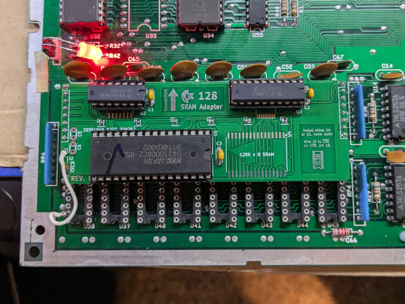

# C128 310381 R7 SRAM Adapter

## DISCLAIMER

Any use of this project is **under your own responsibility**.
You will be responsible of checking the correct construction and functionality of your board.
By using this project You will agree that I cannot be held responsible if it will destroy any of your devices, damage your computer, burn down your house or whatever.

**WARNING**: This device was only tested to fit on a motherboard model 310381R7!!!

**ANOTHER WARNING**: This device is still under testing, and while it seems to be working without issues on my C128, there are no guarantees!

## Introduction

This board implements a static RAM replacement for the DRAMs on a C128 with a 310381R7 motherboard.

You will have to remove and socket your DRAM ICs to install this board. Please, do not kill innocent DRAM ICs by cutting their legs!

### Ordering the boards

You can order the board for this project at [PCBWay](https://www.pcbway.com/project/shareproject/TODO.html) and support me or download 
the gerbers and have them printed wherever you like!!!

## Features

- You can choose to use SMD or DIP components
- Once the DRAMs are socketed, the board is easy to plug in and remove

## Hardware

The board was designed with [KiCad](https://kicad.org/) EDA.

### Bill of Materials

| Component              | Qty | Type / Value                                            | Notes                                                                |
| ---------------------- | --- | ------------------------------------------------------- | -------------------------------------------------------------------- |
| C1, C2, C3             |  3  | 100nF ceramic cap, SMD 1206 or 2.54mm through hole      | Decoupling caps, rated at least 10V.                                 |
| C5, C6                 |  2  | ~82-820pF ceramic cap, 1206 or THT 2.54mm               | Optional tweak on CAS timing, normally no need to fit this           |
| U1, U4                 |  1  | 128Kx8 SRAM, DIP32 or SOP32      | I tested 85ns SRAMs without issue. 628128 pinout. Install either U1 or U4.                  |
| U2                     |  1  | 74HCT00, DIP14 or SO14           | Can be replaced with an ACT/ALS/LS/F. Do NOT use an HC. Note: Only F and LS currently tested|
| U3                     |  1  | 74HCT573, DIP 20 or TSSOP20      | Can be replaced with an ACT/ALS/LS/F. Do NOT use an HC. Note: Only HCT currently tested     |
| J2                     |  1  | Angled header or wire            | Install an angled header or a wire that goes to the second CAS line, U38 pin 15             |
| Headers                |  1  | 40p 2.54mm machined header strip | Cut it into 4x8p and 6x1p pieces, then solder on the underside                              |

### Known Issues

I could not detect stability issues. Yet.
